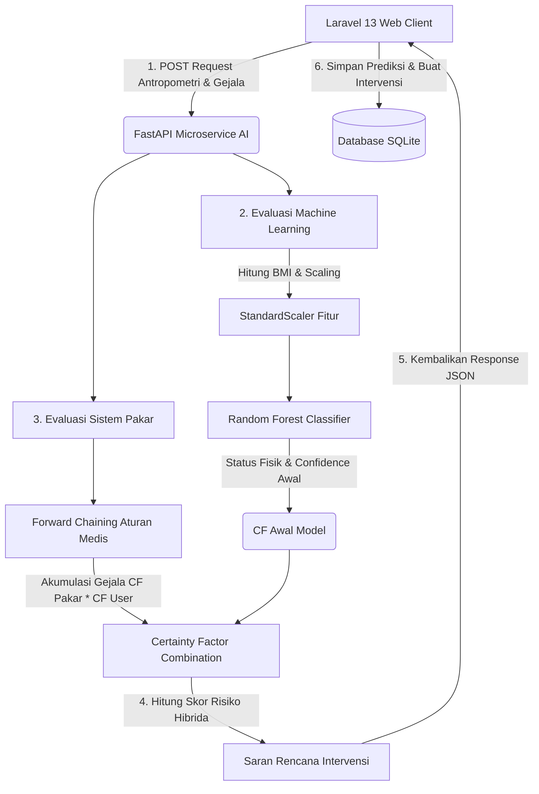

# 📊 BAHAN BACAAN PRESENTASI
## Sistem Pakar Hybrid AI - Prediksi & Manajemen Stunting pada Balita

Dokumen ini disusun sebagai panduan membaca dan materi presentasi untuk menjelaskan arsitektur, pemilihan algoritma, serta mekanisme kerja **Sistem Pakar Hybrid AI** dalam proyek deteksi dini dan manajemen stunting balita.

---

## 🔍 DAFTAR ISI
1. [Slide 1: Judul & Pengenalan Proyek](#slide-1-judul--pengenalan-proyek)
2. [Slide 2: Latar Belakang & Urgensi Solusi](#slide-2-latar-belakang--urgensi-solusi)
3. [Slide 3: Arsitektur Sistem (Decoupled Microservices)](#slide-3-arsitektur-sistem-decoupled-microservices)
4. [Slide 4: Machine Learning - Klasifikasi Fisik Antropometri](#slide-4-machine-learning---klasifikasi-fisik-antropometri)
5. [Slide 5: Alasan Memilih Algoritma Random Forest](#slide-5-alasan-memilih-algoritma-random-forest)
6. [Slide 6: Sistem Pakar - Evaluasi Gejala Klinis & Riwayat Medis](#slide-6-sistem-pakar---evaluasi-gejala-klinis--riwayat-medis)
7. [Slide 7: Alasan Memilih Certainty Factor & Forward Chaining](#slide-7-alasan-memilih-certainty-factor--forward-chaining)
8. [Slide 7a: Mengapa Memilih Sistem Pakar dibanding Metode AI Lain?](#slide-7a-mengapa-memilih-sistem-pakar-dibanding-metode-ai-lain)
9. [Slide 8: Formula Matematika Certainty Factor (CF)](#slide-8-formula-matematika-certainty-factor-cf)
10. [Slide 9: Klasifikasi Tingkat Risiko & Rekomendasi Intervensi](#slide-9-klasifikasi-tingkat-risiko--rekomendasi-intervensi)
11. [Slide 10: Kesimpulan & Keunggulan Sistem](#slide-10-kesimpulan--keunggulan-sistem)

---

### Slide 1: Judul & Pengenalan Proyek
*   **Judul Presentasi**: Kolaborasi Machine Learning dan Sistem Pakar untuk Deteksi Dini & Manajemen Stunting Balita
*   **Nama Sistem**: Sistem Pakar Hybrid AI - Prediksi & Manajemen Stunting
*   **Definisi Singkat**: Sistem berbasis web yang mengombinasikan kekuatan **Machine Learning (Random Forest)** untuk klasifikasi antropometri fisik balita berdasarkan standar WHO dan **Sistem Pakar (Certainty Factor & Forward Chaining)** untuk penilaian gejala klinis serta riwayat kesehatan oleh Kader atau Bidan.

---

### Slide 2: Latar Belakang & Urgensi Solusi
*   **Masalah Utama**: Stunting merupakan ancaman besar bagi tumbuh kembang generasi masa depan. Deteksi dini sering kali terlambat karena:
    1.  Pengukuran antropometri fisik (berat badan/tinggi badan) saja tanpa analisis mendalam sering kali luput mendeteksi risiko stunting sebelum anak benar-benar menjadi pendek (*stunted*).
    2.  Petugas lapangan (kader posyandu) memiliki tingkat kepastian (*certainty*) yang bervariasi dalam mengidentifikasi gejala klinis awal.
    3.  Kurangnya integrasi antara hasil skrining dengan rencana aksi intervensi gizi yang cepat dan terverifikasi.
*   **Solusi Proyek Ini**: Menggabungkan pendekatan data kuantitatif fisik (Machine Learning) dengan pengetahuan kualitatif medis (Sistem Pakar) untuk menghasilkan deteksi stunting yang akurat, komprehensif, dan langsung merekomendasikan tindakan medis terarah.

---

### Slide 3: Arsitektur Sistem (Decoupled Microservices)
Sistem ini menggunakan arsitektur **Decoupled Microservices** yang memisahkan aplikasi web manajemen data (Laravel) dan mesin pemroses kecerdasan buatan (FastAPI).

*   **Keuntungan Arsitektur**:
    *   **Kecepatan**: Skrining AI berjalan sangat cepat karena dieksekusi di microservice terpisah berbasis Python FastAPI yang ringan.
    *   **Skalabilitas**: Modul AI dapat ditingkatkan kemampuannya tanpa mengganggu jalannya aplikasi web utama.

---

### Slide 4: Machine Learning - Klasifikasi Fisik Antropometri
*   **Fungsi**: Skrining fisik awal balita berdasarkan 5 parameter utama:
    1.  Jenis Kelamin (*Gender*)
    2.  Usia (*Age in Months*)
    3.  Berat Badan (*Weight* dalam kg)
    4.  Tinggi Badan (*Height* dalam cm)
    5.  *Body Mass Index* (BMI, dihitung otomatis: $BMI = \frac{Berat}{(Tinggi/100)^2}$)
*   **Dataset Pelatihan**: Data log tumbuh kembang sebanyak **40.071** catatan balita dari berbagai Posyandu dan Puskesmas, melalui tahap pembersihan data (*missing values treatment*), rekayasa fitur (*feature engineering*), dan normalisasi skala (*StandardScaler*).
*   **Output Model**: Klasifikasi awal (`Normal` atau `Stunting`) serta probabilitas prediksi ($CF_{ML}$) antara `0.0` hingga `1.0`.

---

### Slide 5: Alasan Memilih Algoritma Random Forest
Dalam eksperimen pelatihan model yang mendalam di Jupyter Notebook, dilakukan komparasi (head-to-head) antara tiga algoritma klasifikasi populer:

| Algoritma | Akurasi (%) | Presisi (%) | Recall (%) | F1-Score (%) |
| :--- | :---: | :---: | :---: | :---: |
| **Random Forest Classifier** | **97.31%** | **97.05%** | **96.27%** | **96.65%** |
| K-Nearest Neighbors (KNN) | 96.24% | 96.26% | 94.38% | 95.31% |
| Naïve Bayes | 42.55% | 41.20% | 98.52% | 58.10% |

**Mengapa Random Forest Terpilih sebagai Model Terbaik?**
1.  **Akurasi Tertinggi**: Mencapai akurasi **97.31%** dan F1-Score **96.65%**, membuktikan ketangguhannya dibandingkan KNN dan Naïve Bayes.
2.  **Mencegah Overfitting (Ensemble Learning)**: Bekerja dengan mengombinasikan ratusan pohon keputusan (*decision trees*) melalui metode *bagging*, sehingga hasil prediksi lebih stabil dan generalisasinya sangat baik pada data baru.
3.  **Kemampuan Menangani Hubungan Non-Linear**: Hubungan antara umur, berat badan, dan tinggi badan anak bersifat kompleks dan non-linear. Random Forest sangat efisien dalam memetakan batas klasifikasi non-linear ini tanpa memerlukan transformasi matematis yang rumit.
4.  **Tahan terhadap Outliers**: Data antropometri di posyandu sering kali mengandung kesalahan input kecil (outliers/noise). Random Forest memiliki toleransi yang tinggi terhadap pencilan data tersebut.

---

### Slide 6: Sistem Pakar - Evaluasi Gejala Klinis & Riwayat Medis
Stunting tidak hanya dinilai dari tinggi badan fisik saja, tetapi juga dipengaruhi oleh kondisi klinis dan riwayat kesehatan anak. Sistem pakar mengevaluasi gejala-gejala berikut:

| Kode Rule | Gejala Klinis / Faktor Risiko | Nilai Kepastian Pakar ($CF_{Pakar}$) | Landasan Medis |
| :---: | :--- | :---: | :--- |
| **R03** | Perlambatan Pertumbuhan Linear (*Linear Faltering*) | **0.80** | Indikator kuat awal stunting secara kronis |
| **R04** | *Weight Faltering* (Gagal Tumbuh) | **0.70** | Kehilangan berat badan secara berkala |
| **R05** | *Wasted* (Gizi Kurang berdasarkan BB/TB) | **0.75** | Indikasi gizi buruk akut berisiko stunting |
| **R06** | Edema Bilateral (*Pitting edema*) | **0.90** | Tanda klinis gizi buruk akut (Kwasiorkor) |
| **R07** | Penyakit Infeksi Berulang (Diare/ISPA) | **0.60** | Penghambat penyerapan gizi balita |
| **R08** | Riwayat BBLR / Prematur | **0.50** | Faktor risiko bawaan lahir |
| **R09** | *Red-Flags* Sistemik (Muntah/Demam) | **0.70** | Gejala akut yang butuh penanganan segera |

> [!NOTE]
> **Informasi Penting Terkait R01 dan R02:**
> Aturan **R01** (Status Fisik Balita: Normal) dan **R02** (Status Fisik Balita: Stunting/Berisiko) tidak tercantum dalam tabel gejala klinis checklist di atas karena keduanya merupakan **keluaran otomatis dari Model Machine Learning (Random Forest)** berdasarkan data kuantitatif antropometri. 
> Nilai keyakinan dari R01/R02 inilah yang dikirim oleh sistem FastAPI sebagai keyakinan dasar fisik ($CF_{ML}$) sebelum diakumulasikan secara runut maju dengan gejala kualitatif (R03 - R09).

---

### Slide 7: Alasan Memilih Certainty Factor & Forward Chaining
Sistem ini tidak menggunakan pendekatan murni Machine Learning untuk gejala klinis, melainkan digabungkan dengan **Forward Chaining** dan **Certainty Factor**. Mengapa?

1.  **Representasi Pengetahuan Pakar (Medical Logic)**: Gejala klinis memiliki tingkat pengaruh (*weight*) yang berbeda secara medis dalam menyebabkan stunting (misal: Edema Bilateral jauh lebih berbahaya daripada riwayat BBLR). Sistem pakar memungkinkan kita menanamkan pengetahuan medis riil ini ke dalam kode.
2.  **Menangani Ketidakpastian Lapangan (Uncertainty)**: Petugas posyandu (Kader) sering kali tidak 100% yakin saat mengobservasi gejala klinis balita. Certainty Factor memfasilitasi input derajat keyakinan kader ($CF_{User}$ skala 0.0 - 1.0) untuk diproses secara akurat.
3.  **Explainable AI (Kecerdasan Buatan yang Dapat Dijelaskan)**: Berbeda dengan model ML yang bersifat "black-box" (sulit dilacak alasannya), kombinasi Forward Chaining memberikan alur logika yang transparan. Bidan dapat melihat gejala apa saja yang memicu tingkat risiko stunting tersebut dan mengapa rekomendasi tertentu diberikan.

---

### Slide 7a: Mengapa Memilih Sistem Pakar dibanding Metode AI Lain?
Di bawah ini adalah pembanding ilmiah mengapa pendekatan **Sistem Pakar (Certainty Factor & Forward Chaining)** dipilih untuk menangani evaluasi klinis stunting pada proyek ini, bukan metode AI alternatif lainnya:

1.  **Bukan Search & Optimization Algorithms (GA, A*, PSO)**
    *   *Alasan Menolak*: Algoritma ini dirancang untuk mencari jalur terpendek, alokasi sumber daya optimal, atau penjadwalan (NP-hard). Prediksi stunting adalah masalah **klasifikasi diagnosis medis**, bukan pencarian rute atau optimalisasi biaya.
2.  **Bukan Logic-Based & Automated Reasoning Murni (SAT Solvers, First-Order Logic)**
    *   *Alasan Menolak*: Logika klasik bersifat biner mutlak (Benar atau Salah). Di lapangan posyandu nyata, ada **ketidakpastian (uncertainty)** subyektif kader dalam menilai gejala klinis (misal: seberapa parah diare berulang balita). Logika murni akan runtuh jika ada informasi klinis yang tidak lengkap atau memiliki ambiguitas.
3.  **Bukan Knowledge Representation Murni (Ontologies, Semantic Web, OWL)**
    *   *Alasan Menolak*: Ontologi sangat baik untuk memetakan hubungan hierarki medis (taksonomi), tetapi **tidak memiliki mekanisme inferensi numerik** untuk mengakumulasi risiko secara kuantitatif ketika beberapa gejala terjadi bersamaan secara dinamis.
4.  **Bukan Constraint Satisfaction Problems (CSP)**
    *   *Alasan Menolak*: CSP bertujuan mencari satu set solusi yang memenuhi batasan kaku (seperti sistem penjadwalan). Pada deteksi stunting, tujuan kita bukan membatasi variabel, melainkan **mengakumulasikan tingkat bahaya (risiko)** dari berbagai gejala klinis yang saling memperkuat secara aditif.
5.  **Bukan Fuzzy Logic (Logika Fuzzy)**
    *   *Alasan Menolak*:
        *   **Fokus Ketidakpastian**: Fuzzy menangani kekaburan nilai (*vagueness*), seperti menentukan kategori tinggi "pendek" atau "sangat pendek". Namun, ketidakpastian fisik antropometri di sistem ini sudah ditangani dengan sangat presisi dan kontinu oleh **Machine Learning (Random Forest)**.
        *   **Subyektivitas Kader**: Certainty Factor dirancang khusus untuk mengukur derajat keyakinan subyektif pakar/user (*degree of belief*) terhadap kehadiran suatu gejala klinis, bukan hanya kekaburan fisik.
        *   **Rule Explosion (Ledakan Aturan)**: Fuzzy Logic memerlukan matriks aturan kombinasi yang membengkak secara eksponensial ($2^N$ aturan untuk $N$ gejala). Dengan Certainty Factor, penggabungan gejala dapat dihitung secara dinamis, modular, dan efisien menggunakan rumus akumulasi satu baris sederhana.

---

### Slide 8: Formula Matematika Certainty Factor (CF)
Proses penggabungan tingkat kepastian dalam sistem ini melalui beberapa tahap perhitungan matematis:

1.  **Menghitung CF untuk Tiap Gejala Klinis ($CF_{Gejala}$)**:
    $$CF_{Gejala} = CF_{Pakar} \times CF_{User}$$
    *Di mana $CF_{Pakar}$ adalah bobot medis bawaan sistem dan $CF_{User}$ adalah keyakinan kader saat skrining (0.0 sampai 1.0).*

2.  **Akumulasi CF secara Berurutan (Sequential Combination)**:
    Jika terdapat beberapa gejala klinis yang aktif beserta hasil probabilitas Machine Learning ($CF_{ML}$), sistem akan menggabungkannya secara berurutan menggunakan rumus:
    $$CF_{Gabungan}(CF_A, CF_B) = CF_A + CF_B \times (1 - CF_A)$$
    *Kombinasi dilakukan satu per satu dari nilai pertama hingga nilai terakhir.*

3.  **Hasil Akhir Persentase Risiko**:
    $$Persen\_Risiko = CF_{Akhir} \times 100\%$$

---

### Slide 9: Klasifikasi Tingkat Risiko & Rekomendasi Intervensi
Setelah persentase risiko stunting dihitung, sistem membagi kesimpulan menjadi 4 tingkat klasifikasi risiko disertai rekomendasi intervensi otomatis:

1.  **Risiko Normal ($< 40\%$)**
    *   *Rekomendasi*: Pertahankan pola makan gizi seimbang dan rutin melakukan kunjungan bulanan ke Posyandu.
2.  **Risiko Stunting / *Stunting Risk* ($40\% - 69.9\%$)**
    *   *Rekomendasi*: Edukasi 'Feeding Rules' IDAI, MPASI kaya protein hewani, pemberian vitamin A/Zinc.
3.  **Stunting / *Stunted* ($70\% - 84.9\%$)**
    *   *Rekomendasi*: Penanganan intensif gizi makro/mikro, rujukan evaluasi puskesmas.
4.  **Sangat Stunting / *Severely Stunted* ($\ge 85\%$) atau Gejala Kritis (R06/R09)**
    *   *Rekomendasi*: **⚠️ SEGERA RUJUK** ke Fasilitas Kesehatan / Puskesmas untuk penanganan gizi buruk akut klinis. Berikan PMT Pemulihan di bawah pengawasan medis ketat.

---

### Slide 10: Kesimpulan & Keunggulan Sistem
*   **Sinergi Hybrid AI**: Menjembatani analisis statistik fisik berbasis data historis (Machine Learning) dengan aturan klinis kedokteran terstruktur (Sistem Pakar).
*   **Manajemen Terintegrasi**: Sistem tidak hanya berhenti pada prediksi, tetapi langsung menghubungkan hasil dengan database **Intervensi** untuk melacak pemulihan balita secara bulanan oleh Bidan Puskesmas.
*   **Dampak Nyata**: Meningkatkan akurasi deteksi dini stunting di tingkat posyandu, meminimalisir kesalahan diagnosis, dan mempercepat respons penanganan balita berisiko stunting di Indonesia.
