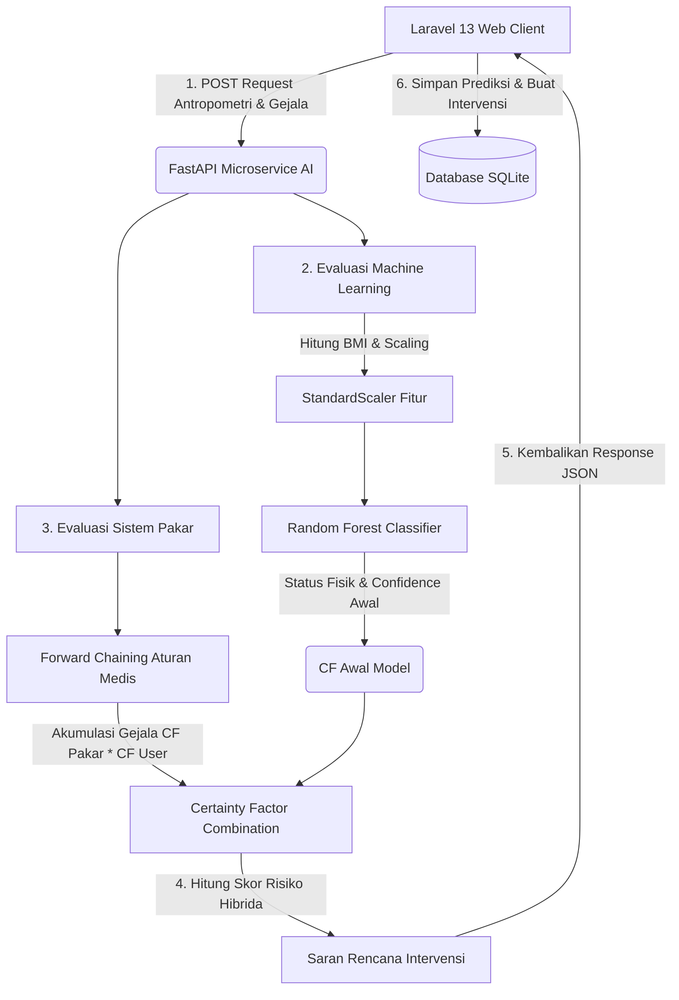

# 👶 Sistem Pakar Hybrid AI - Prediksi & Manajemen Stunting

[](https://laravel.com)
[](https://fastapi.tiangolo.com)
[](https://tailwindcss.com)
[](https://pestphp.com)
[](https://opensource.org/licenses/MIT)

Sistem Pakar Hybrid AI untuk deteksi dini stunting dan manajemen tumbuh kembang balita berbasis web. Proyek ini menggabungkan kekuatan **Machine Learning (Random Forest)** untuk klasifikasi antropometri fisik balita berdasarkan standar WHO dan **Sistem Pakar (Certainty Factor & Forward Chaining)** untuk penilaian gejala klinis serta riwayat kesehatan oleh Kader/Bidan.

---

## 🏗️ Arsitektur & Alur Kerja Sistem

Sistem ini dirancang menggunakan arsitektur **Decoupled Microservices** yang memisahkan client/manajemen web (Laravel) dengan modul kecerdasan buatan (FastAPI).



---

## 🧠 Mekanisme Hybrid AI (Random Forest + Certainty Factor)

### 1. Klasifikasi Fisik (Machine Learning)
Model **Random Forest Classifier** yang dilatih menggunakan data log tumbuh kembang (40.000+ data antropometri) mengklasifikasikan status gizi fisik balita berdasarkan 5 fitur input:
*   Jenis Kelamin (Gender)
*   Usia (Bulan)
*   Berat Badan (kg)
*   Tinggi Badan (cm)
*   *Body Mass Index* (BMI - dihitung otomatis oleh sistem)

Output dari tahap ini adalah klasifikasi awal status gizi serta nilai probabilitas klasifikasi (dianggap sebagai **Certainty Factor Awal / $CF_{ML}$**).

### 2. Evaluasi Gejala Klinis (Sistem Pakar)
Kader atau bidan mengisi checklist gejala klinis luar yang dialami balita dengan tingkat keyakinan (*Certainty Factor User* / $CF_{User}$) berskala `0.0` (Tidak yakin) sampai `1.0` (Sangat yakin). Gejala klinis yang dievaluasi mencakup:

| Kode Rule | Gejala Klinis / Faktor Risiko | $CF_{Pakar}$ |
| :---: | :--- | :---: |
| **R03** | Perlambatan Pertumbuhan Linear (*Linear Faltering*) | 0.80 |
| **R04** | *Weight Faltering* (Gagal Tumbuh) | 0.70 |
| **R05** | *Wasted* (Gizi Kurang berdasarkan BB/TB) | 0.75 |
| **R06** | Edema Bilateral (*Pitting*) | 0.90 |
| **R07** | Penyakit Infeksi Berulang (Diare/ISPA) | 0.60 |
| **R08** | Riwayat BBLR / Prematur | 0.50 |
| **R09** | *Red-Flags* Sistemik (Muntah/Demam) | 0.70 |

### 3. Akumulasi Skor Risiko Akhir
Setiap gejala yang dialami dihitung nilai keyakinannya:
$$CF_{Gejala} = CF_{Pakar} \times CF_{User}$$

Kemudian, seluruh $CF$ dari Machine Learning ($CF_{ML}$) dan semua $CF_{Gejala}$ yang bernilai positif dikombinasikan secara berurutan menggunakan rumus akumulasi Certainty Factor:
$$CF_{Gabungan}(CF_A, CF_B) = CF_A + CF_B \times (1 - CF_A)$$

Skor akhir diubah dalam bentuk persentase (0-100%) dan dipetakan menjadi kategori keputusan:
*   **$< 40\%$**: Normal
*   **$40\% - 69.9\%$**: Risiko Stunting (*Stunting Risk*)
*   **$70\% - 84.9\%$**: Stunting (*Stunted*)
*   **$\ge 85\%$**: Sangat Stunting (*Severely Stunted*)

---

## 🛠️ Stack Teknologi & Prasyarat Sistem

### Persyaratan Sistem Minimum
*   **Sistem Operasi**: Windows 10/11, Linux, atau macOS
*   **PHP**: v8.3 atau lebih tinggi
*   **Node.js**: v18.0 atau lebih tinggi (bersama NPM)
*   **Python**: v3.10 atau lebih tinggi (bersama pip)
*   **Composer**: v2.0 atau lebih tinggi

### Spesifikasi Stack
#### 1. Web Application (`web-app`)
*   **Framework**: Laravel 13
*   **Frontend**: Livewire 3 (Volt Anonymous Component Architecture) & Alpine.js
*   **CSS / UI**: TailwindCSS v4 & Flux UI (Premium component library)
*   **Database**: SQLite

#### 2. Microservice AI (`ml-model`)
*   **API Framework**: FastAPI (Python)
*   **Server**: Uvicorn
*   **Libraries**: Scikit-Learn, Pandas, NumPy, Joblib, Openpyxl

---

## 📂 Struktur Direktori Proyek

```bash
stunting-prediction-system/
├── ml-model/                          # Python FastAPI AI Microservice
│   ├── artikel/                       # PDF Jurnal & landasan ilmiah bobot pakar
│   ├── venv/                          # Virtual environment Python (lokal)
│   ├── main.py                        # Entry point FastAPI & endpoint /predict
│   ├── rules.py                       # Logika Certainty Factor & Forward Chaining
│   ├── requirements.txt               # Daftar pustaka dependensi Python
│   ├── model_rf_stunting_terbaik.pkl  # Biner model Random Forest terlatih
│   ├── scaler_stunting.pkl            # Biner StandardScaler fitur antropometri
│   ├── machine-learning.ipynb         # Jupyter Notebook proses analisis & training ML
│   └── Overall data.xlsx              # Dataset mentah logs tumbuh kembang balita
│
└── web-app/                           # Laravel 13 Web Application
    ├── app/                           # Controller, Service, Models, & Providers
    ├── bootstrap/                     # Konfigurasi booting aplikasi
    ├── config/                        # File konfigurasi sistem Laravel
    ├── database/                      # Migrasi database SQLite, Factories, & Seeders
    ├── public/                        # Aset publik statis (images, favicon, etc)
    ├── resources/                     # Views (Blade, Livewire Volt components, css)
    ├── routes/                        # Routing aplikasi (web, console, settings)
    ├── tests/                         # Unit & Feature Testing (Pest)
    ├── composer.json                  # Konfigurasi dependensi PHP & Script project
    ├── package.json                   # Konfigurasi dependensi Node/JS & Tailwind v4
    └── vite.config.js                 # Konfigurasi bundler Vite
```

---

## 💾 Skema Database & Relasi Tabel

Aplikasi menggunakan database SQLite dengan 6 tabel utama:

1.  **`users`**: Menyimpan data pengguna dengan role: `bidan` (super/verifikator), `kader` (operator posyandu), dan `orang_tua` (pemilik data balita).
2.  **`posyandus`**: Menyimpan data posyandu di wilayah kerja Puskesmas.
3.  **`posyandu_sessions`**: Jadwal dan sesi pelaksanaan bulanan posyandu.
4.  **`children`**: Menyimpan profil balita (nama, tanggal lahir, NIK, gender, alamat, relasi ke posyandu dan orang tua).
5.  **`predictions`**: Menyimpan snapshot rekam pemeriksaan bulanan balita, input antropometri fisik, hasil prediksi AI, persentase risiko, dan catatan bidan.
6.  **`interventions`**: Otomatis dibuat saat hasil prediksi berupa `stunting_risk`, `stunted`, atau `severely_stunted`. Menyimpan data penanganan gizi, catatan tindak lanjut, target kunjungan ulang, dan status penanganan (`pending`, `in_progress`, `done`, `cancelled`).

---

## 🚀 Panduan Instalasi & Setup Lokal

Ikuti langkah-langkah di bawah ini untuk menyiapkan lingkungan pengembangan lokal Anda:

### Langkah 1: Clone Repositori
```bash
git clone https://github.com/zakyrmh/stunting-prediction-system.git
cd stunting-prediction-system
```

---

### Langkah 2: Setup Microservice AI (FastAPI)

1.  Masuk ke folder `ml-model`:
    ```bash
    cd ml-model
    ```
2.  Buat dan aktifkan virtual environment Python:
    ```bash
    # Windows (PowerShell)
    # Catatan: Jika script activation diblokir oleh sistem, jalankan dahulu di PowerShell Anda:
    # Set-ExecutionPolicy -ExecutionPolicy RemoteSigned -Scope Process
    python -m venv venv
    .\venv\Scripts\Activate.ps1

    # Windows (Command Prompt)
    python -m venv venv
    .\venv\Scripts\activate.bat

    # Linux / macOS
    python3 -m venv venv
    source venv/bin/activate
    ```
3.  Install semua dependensi dari file `requirements.txt`:
    ```bash
    # Jika virtual environment sudah aktif:
    pip install -r requirements.txt

    # Alternatif (tanpa mengaktifkan virtual environment secara manual):
    # Windows:
    .\venv\Scripts\python -m pip install -r requirements.txt
    # Linux / macOS:
    ./venv/bin/python -m pip install -r requirements.txt
    ```
4.  Jalankan server API FastAPI di port `8001`:
    ```bash
    # Menjalankan menggunakan Python Virtual Environment secara langsung
    # (Sangat Direkomendasikan untuk menghindari konflik PATH pada sistem operasi Windows)
    # Windows:
    .\venv\Scripts\python -m uvicorn main:app --port 8001 --reload
    
    # Linux / macOS:
    ./venv/bin/python -m uvicorn main:app --port 8001 --reload
    
    # Atau jika virtual environment sudah teraktivasi dengan benar di terminal:
    uvicorn main:app --port 8001 --reload
    ```
    > [!IMPORTANT]
    > **PEMECAHAN MASALAH (TROUBLESHOOTING):**
    > Jika Anda menemui error `ModuleNotFoundError: No module named 'joblib'` ketika menjalankan server, ini berarti sistem memanggil executable `uvicorn` global di luar folder `venv` Anda. Solusinya, panggil python dari virtual environment secara langsung seperti di atas: **`.\venv\Scripts\python -m uvicorn main:app --port 8001 --reload`**.

    > [!TIP]
    > Server FastAPI Anda kini aktif di `http://127.0.0.1:8001`. Anda dapat membuka dokumentasi interaktif Swagger API di `http://127.0.0.1:8001/docs`.

---

### Langkah 3: Setup Web App (Laravel)

1.  Buka terminal baru di direktori root proyek `stunting-prediction-system`, lalu masuk ke folder `web-app`:
    ```bash
    cd web-app
    ```
2.  Jalankan perintah instalasi terpadu (script ini akan menyalin file `.env.example` ke `.env`, melakukan `composer install`, men-generate App Key, membuat file database SQLite, menjalankan migrasi database dengan seeder, dan mem-build asset frontend):
    ```bash
    composer run setup
    ```
3.  Jalankan server pengembangan Laravel:
    ```bash
    composer run dev
    ```
    > [!NOTE]
    > Perintah `composer run dev` menggunakan pustaka `concurrently` untuk menjalankan web server Laravel (`php artisan serve`), queue listener, dan Vite watcher (`npm run dev`) secara bersamaan dalam satu jendela terminal.
    
    Aplikasi web dapat diakses secara lokal di **`http://127.0.0.1:8000`**.

---

## 🔑 Akun Uji Coba Default

Gunakan kredensial berikut untuk masuk ke sistem setelah database di-seed:

| Peran (Role) | Nama Pengguna | Email | Sandi | Hak Akses |
| :--- | :--- | :--- | :--- | :--- |
| **Bidan** | Bidan Indah | `bidan@example.com` | `password` | Mengelola data posyandu, memantau riwayat prediksi se-wilayah, manajemen akun bidan/kader, verifikasi manual status intervensi. |
| **Kader** | Kader Ani | `kader@example.com` | `password` | Mendaftarkan balita baru, mengedit profil balita, mencatat pengukuran bulanan & deteksi risiko AI, memperbarui catatan intervensi. |
| **Orang Tua** | Ibu Rahma | `ibu@example.com` | `password` | Mengakses dashboard personal, melihat perkembangan tumbuh kembang, grafik, dan riwayat intervensi anak-anaknya secara mandiri. |

---

## 🧪 Cara Menjalankan Pengujian Otomatis

Aplikasi web telah dilengkapi dengan serangkaian pengujian otomatis fungsional terintegrasi menggunakan **Pest PHP**.

Sebelum menjalankan pengujian, pastikan FastAPI server di port `8001` dalam kondisi **aktif/berjalan**. Kemudian, jalankan perintah di dalam direktori `web-app`:
```bash
php artisan test
```

---

## 📈 Dokumentasi API (Endpoint `/predict`)

FastAPI menyediakan satu endpoint utama yang digunakan oleh Laravel untuk melakukan kalkulasi prediksi hybrid:

*   **Endpoint**: `/predict`
*   **Metode**: `POST`
*   **Content-Type**: `application/json`

### Body Permintaan (Request Body)
```json
{
  "gender": 0,
  "age_months": 18.0,
  "weight": 10.5,
  "height": 78.5,
  "gejala_cf": {
    "R03": 1.0,
    "R04": 0.5,
    "R07": 0.8
  }
}
```

### Parameter Kunci:
*   `gender`: `0` (Laki-laki) atau `1` (Perempuan).
*   `age_months`: Umur anak dalam bulan (float/integer).
*   `weight`: Berat badan dalam kg (float).
*   `height`: Tinggi badan dalam cm (float).
*   `gejala_cf`: Objek JSON yang memuat pasangan kode gejala (`R03`-`R09`) dan nilai keyakinan Kader (`0.0` sampai `1.0`).

### Contoh Respons Sukses (200 OK)
```json
{
  "status_kode": 200,
  "pesan": "Analisis sistem pakar hybrid berhasil",
  "kalkulasi_fisik": {
    "bmi": 17.06,
    "status_skrining_ml": "Normal",
    "probabilitas_ml_murni": 14.5
  },
  "kesimpulan_sistem_pakar": {
    "tingkat_risiko_total_persen": 89.24,
    "gejala_terdeteksi": [
      "R03",
      "R04",
      "R07"
    ],
    "rekomendasi_intervensi": [
      "⚠️ SEGERA RUJUK ke Fasilitas Kesehatan / Puskesmas untuk penanganan gizi buruk akut klinis.",
      "Berikan PMT (Pemberian Makanan Tambahan) Pemulihan di bawah pengawasan medis."
    ]
  }
}
```

---

## 🤝 Panduan Kontribusi

Jika Anda ingin berpartisipasi dalam pengembangan proyek ini, silakan ikuti alur kerja berikut:

1.  **Fork** repositori ini.
2.  Buat cabang fitur baru Anda:
    ```bash
    git checkout -b fitur/nama-fitur-anda
    ```
3.  Lakukan perubahan kode dan pastikan semua pengujian lulus:
    ```bash
    php artisan test
    ```
4.  Lakukan commit terhadap perubahan Anda:
    ```bash
    git commit -m "feat: Menambahkan fitur X"
    ```
5.  Kirimkan perubahan Anda ke repositori asal (Push):
    ```bash
    git push origin fitur/nama-fitur-anda
    ```
6.  Buka **Pull Request** di GitHub dan jelaskan detail perubahan yang Anda lakukan.

---

## 📄 Lisensi

Proyek ini dilisensikan di bawah Lisensi MIT. Detail selengkapnya dapat dilihat pada berkas `LICENSE` (jika ada).
