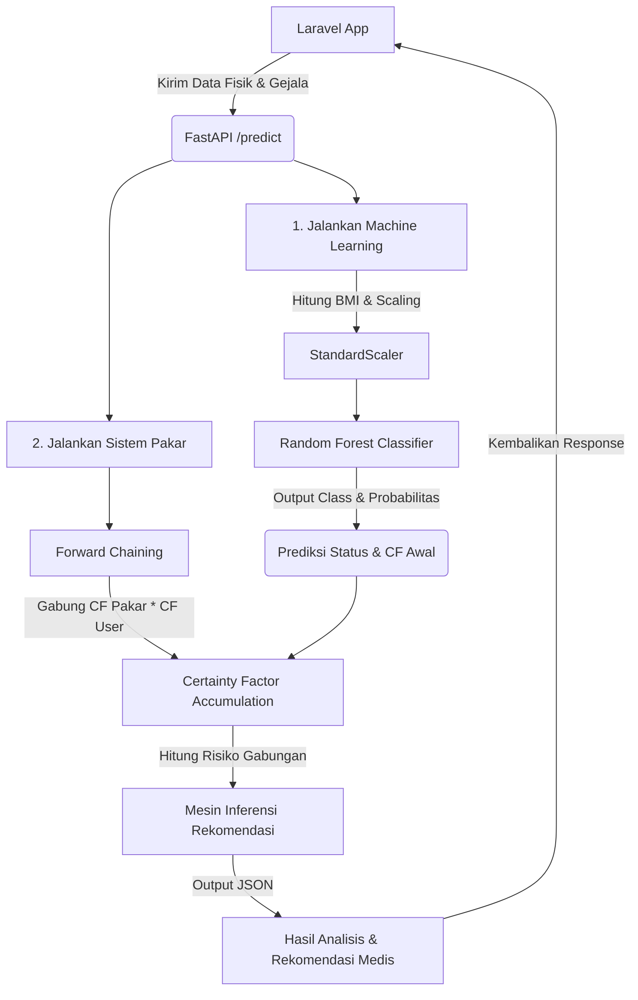

# 🧠 Sistem Pakar Hybrid Stunting - Microservice AI

Repositori ini berisi kode sumber, model *machine learning*, basis pengetahuan sistem pakar, dan dataset yang digunakan untuk sistem prediksi risiko stunting pada balita. Sistem ini menggunakan pendekatan **Hybrid AI** dengan menggabungkan **Random Forest (Machine Learning)** untuk analisis antropometri fisik dan **Certainty Factor & Forward Chaining (Sistem Pakar)** untuk analisis gejala klinis & riwayat kesehatan.

---

## 📂 Struktur Direktori dan File

Berikut adalah penjelasan fungsi dari setiap file dan folder yang berada di dalam direktori `ml-model`:

```bash
ml-model/
├── artikel/                               # Dokumen referensi ilmiah
│   ├── 1210-Article Text-6350-1-10-20240211.pdf
│   └── 15296-Article Text-25178-1-10-20251003.pdf
├── venv/                                  # Virtual Environment Python (Lokal)
├── .gitignore                             # Konfigurasi file yang diabaikan Git
├── Overall data.xlsx                      # Dataset mentah pengukuran balita
├── machine-learning.ipynb                 # Jupyter Notebook proses pelatihan model
├── rules.py                               # Basis pengetahuan & aturan Certainty Factor
├── main.py                                # API Service berbasis FastAPI
├── model_rf_stunting_terbaik.pkl          # Model Random Forest yang sudah dilatih
└── scaler_stunting.pkl                    # Scaler fitur antropometri (StandardScaler)
```

### 📄 Penjelasan Rinci File & Folder

#### 1. [artikel/](file:///c:/laragon/www/stunting-prediction-system/ml-model/artikel) (Folder)
Berisi artikel/jurnal penelitian ilmiah dalam format PDF yang digunakan sebagai landasan teori dan referensi medis dalam menentukan nilai bobot kepastian pakar (*Certainty Factor*) untuk masing-masing gejala klinis stunting.

#### 2. [.gitignore](file:///c:/laragon/www/stunting-prediction-system/ml-model/.gitignore)
File konfigurasi untuk mencegah file besar atau berkas lokal ter-commit ke Git. File yang diabaikan meliputi folder `venv/`, `__pycache__/`, `artikel/`, serta model biner berkode `.pkl` dan data Excel `.xlsx`.

#### 3. [Overall data.xlsx](file:///c:/laragon/www/stunting-prediction-system/ml-model/Overall%20data.xlsx)
Dataset utama dalam format Excel yang berisi 40.071 baris data log pengukuran tumbuh kembang balita dari berbagai Posyandu dan Puskesmas. Data ini digunakan untuk melatih model klasifikasi *machine learning*.

#### 4. [machine-learning.ipynb](file:///c:/laragon/www/stunting-prediction-system/ml-model/machine-learning.ipynb)
Jupyter Notebook yang mendokumentasikan seluruh alur eksperimen *Data Science*:
*   **Eksplorasi & Pembersihan Data**: Menangani nilai kosong (*missing values*), konversi tipe data, penanganan tanggal, dan penyatuan data dari beberapa *sheet*.
*   **Feature Engineering**: Pembuatan fitur baru berupa Body Mass Index (BMI) dari berat dan tinggi badan.
*   **Data Encoding**: Mengubah data kategorikal (seperti jenis kelamin dan kelas target stunting) menjadi representasi numerik.
*   **Training & Evaluasi Model**: Melatih algoritma klasifikasi *Random Forest*, melakukan penyetelan hyperparameter, evaluasi metrik (Akurasi, F1-Score, dll.), serta mengekspor model dan scaler terbaik menggunakan `joblib`.

#### 5. [rules.py](file:///c:/laragon/www/stunting-prediction-system/ml-model/rules.py)
Mesin inferensi dan basis pengetahuan sistem pakar:
*   Mendefinisikan daftar kode gejala klinis dan faktor risiko stunting (misal: R03 hingga R09) beserta nilai bobot kepastian dokter/pakar (`cf_pakar`).
*   Mengimplementasikan fungsi `hitung_cf_kombinasi` menggunakan algoritma *Forward Chaining* dan rumus akumulasi *Certainty Factor* (menggabungkan keyakinan prediksi dari *Machine Learning* dan penilaian gejala luar dari *User*).
*   Mengimplementasikan fungsi `dapatkan_rekomendasi` untuk memberikan saran tindakan medis dan intervensi gizi yang dinamis dan spesifik berdasarkan hasil kalkulasi sistem pakar.

#### 6. [main.py](file:///c:/laragon/www/stunting-prediction-system/ml-model/main.py)
Entry point microservice AI yang dibangun menggunakan framework **FastAPI**:
*   Memuat model Random Forest (`model_rf_stunting_terbaik.pkl`) dan standar penskalaan (`scaler_stunting.pkl`) saat aplikasi dijalankan.
*   Mengekspos endpoint utama `POST /predict` untuk menerima data fisik antropometri balita serta daftar gejala yang terdeteksi, melakukan kalkulasi hybrid, dan mengembalikan hasil analisis lengkap ke aplikasi Laravel.
*   Mengekspos endpoint `GET /` untuk *health check* status keaktifan server AI.

#### 7. [model_rf_stunting_terbaik.pkl](file:///c:/laragon/www/stunting-prediction-system/ml-model/model_rf_stunting_terbaik.pkl)
File biner serialisasi model *Random Forest Classifier* yang telah dilatih dan dioptimalkan secara mendalam menggunakan dataset pertumbuhan balita.

#### 8. [scaler_stunting.pkl](file:///c:/laragon/www/stunting-prediction-system/ml-model/scaler_stunting.pkl)
File biner serialisasi objek `StandardScaler` dari scikit-learn. Scaler ini memastikan fitur input fisik yang dikirim dari Laravel (seperti Umur, Tinggi Badan, Berat Badan, dan BMI) diskalakan dengan rentang yang sama seperti yang digunakan saat pelatihan model.

---

## 🛠️ Alur Kerja Sistem Pakar Hybrid



---

## 🚀 Cara Menjalankan Microservice AI Secara Lokal

Ikuti langkah-langkah berikut untuk menjalankan server FastAPI secara lokal:

### 1. Masuk ke Direktori Model
Buka terminal dan arahkan ke folder `ml-model`:
```powershell
cd ml-model
```

### 2. Buat & Aktifkan Virtual Environment
```powershell
# Membuat virtual environment
python -m venv venv

# Mengaktifkan di Windows (PowerShell)
.\venv\Scripts\Activate.ps1
```

### 3. Install Dependensi yang Dibutuhkan
Silakan install pustaka Python berikut:
```powershell
pip install fastapi uvicorn pydantic numpy pandas scikit-learn openpyxl joblib
```

### 4. Jalankan Aplikasi dengan Uvicorn
Jalankan server pengembangan FastAPI:
```powershell
uvicorn main:app --reload
```
Aplikasi akan aktif secara default di `http://127.0.0.1:8000`. Anda dapat mengakses dokumentasi API interaktif Swagger di `http://127.0.0.1:8000/docs`.
